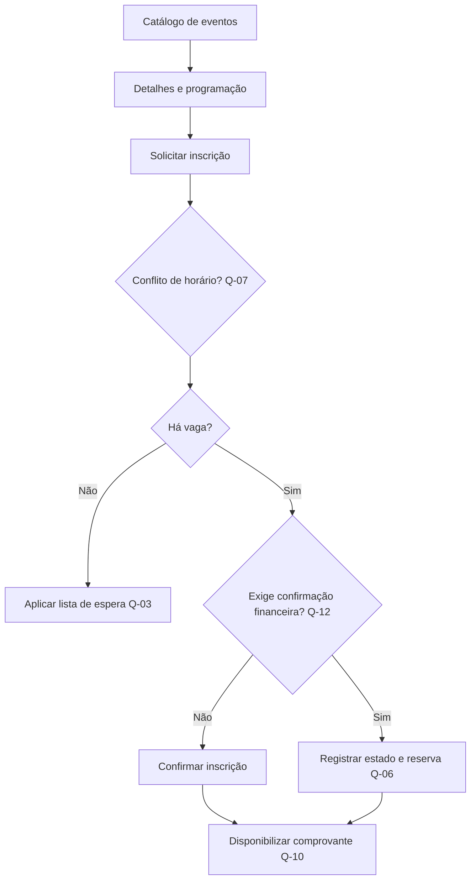

# Protótipos de Baixa Fidelidade e Fluxos

Os protótipos abaixo especificam conteúdo e navegação, não identidade visual. Campos ou ações dependentes de questões abertas são marcados com `Q-nn`.

## Fluxo principal de inscrição

## Tela 1 - Catálogo de eventos

| Região | Conteúdo ou ação | Origem |
|---|---|---|
| Cabeçalho | Título “Eventos disponíveis” | E-01 |
| Lista | Identificação do evento e informações necessárias à decisão | RF-01, RF-03 |
| Estado vazio | Mensagem de ausência de eventos disponíveis | CA-01.2 |
| Ação | Acessar detalhes e programação | HU-01 |

## Tela 2 - Detalhes e inscrição

| Região | Conteúdo ou ação | Observação |
|---|---|---|
| Resumo | Informações do evento, atividades, horários e situação de vagas | Campos exatos a validar. |
| Condição financeira | Indicação de evento gratuito ou pago | E-11. |
| Programação | Workshops, inclusive atividades simultâneas | E-10. |
| Ação principal | Solicitar inscrição | Pode depender de Q-07 e Q-12. |
| Retorno | Estado da solicitação e acesso ao comprovante | Semântica depende de Q-10. |

## Tela 3 - Minhas inscrições

| Região | Conteúdo ou ação | Observação |
|---|---|---|
| Lista | Inscrições do participante e estados atuais | Estados a refinar. |
| Ação | Consultar comprovante | Q-10. |
| Ação | Solicitar cancelamento | Visível apenas quando a política permitir. |
| Ação | Emitir certificado | Disponível após evento e conforme Q-04. |
| Mensagem | Explicação quando o cancelamento não for permitido | E-08. |

## Tela 4 - Painel do organizador

| Região | Conteúdo ou ação | Observação |
|---|---|---|
| Indicadores | Capacidade, ocupação e quantidade de inscritos | Composição e latência dependem de Q-11. |
| Eventos | Criar evento e acessar seus participantes | S-02. |
| Lista de espera | Quantidade aguardando e próximas ações | Ordenação e promoção dependem de Q-03. |
| Alertas | Capacidade atingida e pendências que afetem vagas | Reserva durante pagamento depende de Q-06. |

## Tela 5 - Controle financeiro

| Região | Conteúdo ou ação | Observação |
|---|---|---|
| Pagamentos | Inscrições que exigem confirmação | Escopo depende de Q-12. |
| Ação | Confirmar pagamento | E-13. |
| Reembolsos | Solicitações e estados | Política depende de Q-02. |
| Auditoria | Autor, data, hora e resultado da operação | Proposta RNF-04. |

## Tela 6 - Área do palestrante

| Região | Conteúdo ou ação | Observação |
|---|---|---|
| Programação | Somente atividades associadas ao palestrante | S-04. |
| Participantes | Lista das próprias atividades | E-14. |
| Campos pessoais | Apenas dados aprovados | Definição depende de Q-08. |

## Validação sugerida

Os protótipos devem ser apresentados separadamente a participantes, organizadores, financeiro e palestrantes. A validação deve registrar dúvidas, alterações e decisões, atualizando a matriz de rastreabilidade antes de elevar a fidelidade visual.
